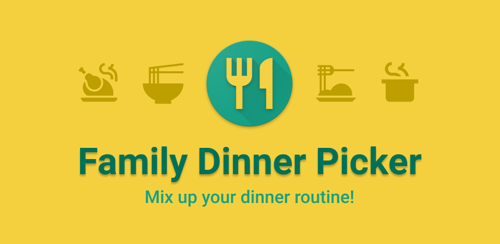
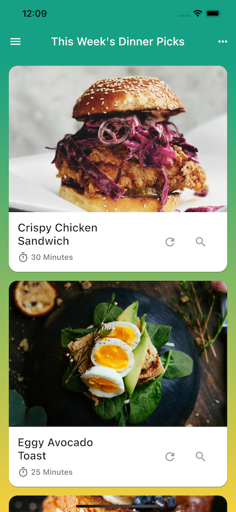
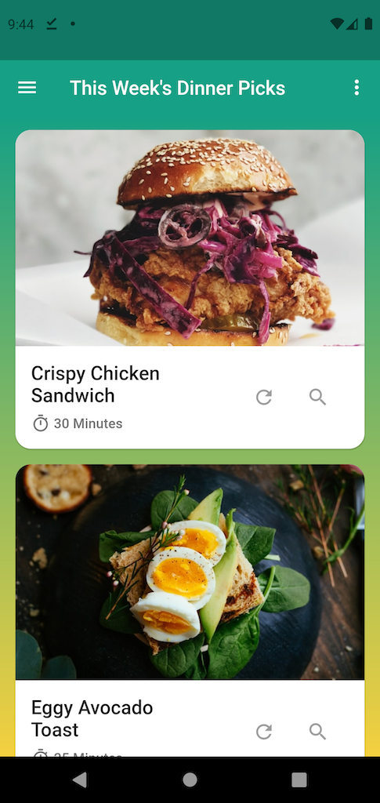

# Family Dinner Picker

  

This repository contains the public information for the Family Dinner Picker app available for
Android and iOS on Google Play and the Apple App Store, respectively.

  
  &nbsp;
  

## About

Meal planning can be dull and tedious. You have lots of meals to choose from, but trying to
remember them all is hard and deciding which ones to plan for each week is like pulling teeth! Now,
Family Dinner Picker can do it all for you in a way that's fun and inclusive!

**Features**

- Use the app as an individual or create a family group to collaborate with others
- Add your favorite dinners along with their prep and cook times
- Give each dinner a great photo; show off your plating skills
- Shuffle a randomized selection of dinners for your upcoming week
- Shuffle one randomized dinner, or choose a specific dinner within the week
- Create an account for cross-device access to your dinners

## Feedback and Support

I'd love to hear any feedback you have about the app. Visit the
[issues](https://github.com/alexgladd/family-dinner-picker/issues) page to send me feedback or
report any issues you're having. Thanks!

## Legal

Copyright 2021 Alex Gladd.

The app's [Privacy Policy](/privacy-policy.md) and [Terms](/terms-and-conditions.md) are available
within this repo.
